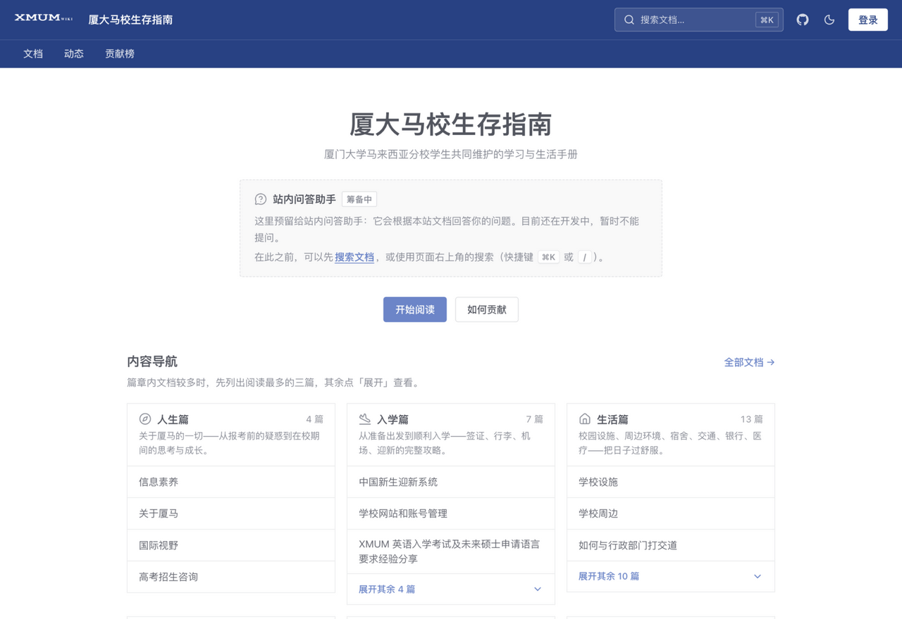
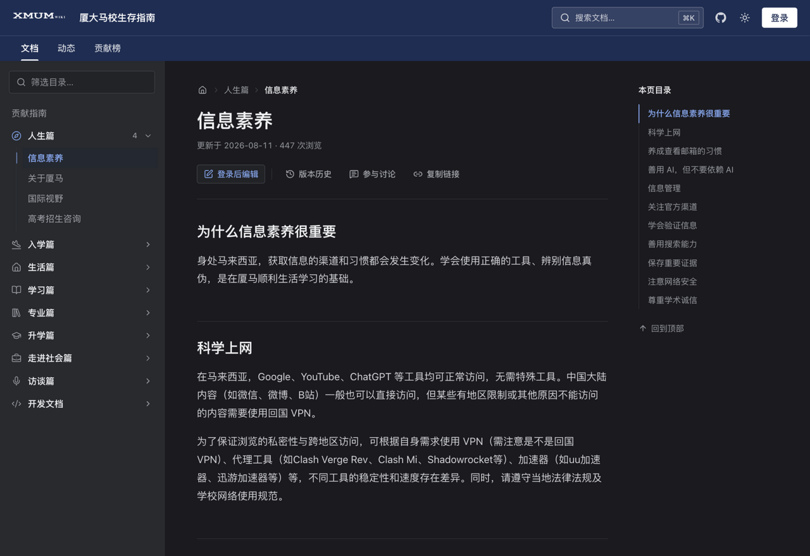
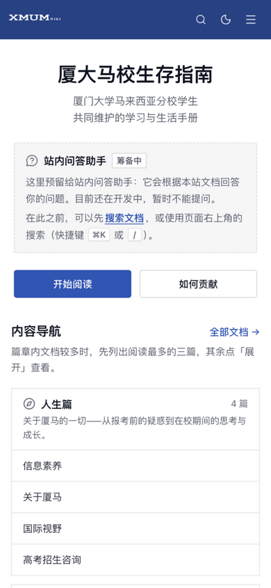

# SurviveXMUM

[](https://github.com/503133214/SurviveXMUM/actions/workflows/frontend.yml)
[](LICENSE)

厦门大学马来西亚分校自救指南 —— <https://surivivexmum.wiki>

SurviveXMUM 是一个帮助厦门大学马来西亚分校（Xiamen University Malaysia, XMUM）学生
更快适应校园与周边生活的指南，由在校学生发起与维护：从入学前的签证行李，到在校的
选课学习、生活琐事，再到毕业后的升学就业，经验都写在站里。

它不是静态站点，而是一个**带后端的在线 Wiki**：内容全部保存在数据库中，同学在网站上
直接编辑、投稿，管理员审核通过后即时生效，**不需要重新构建或合并代码**。

## 界面预览

| 首页（桌面 · 亮色） | 文档页（桌面 · 暗色） |
|:---:|:---:|
|  |  |



## 功能

- **在线编辑与投稿审核**：站内 Markdown 编辑器（工具栏、实时预览、图片上传），
  任意页面点「编辑」即可提交修改；新页面同样由用户创建，管理员审核通过后立即上线。
- **版本历史与对比**：每次修改都有记录，可查看并逐行对比历史版本，出问题能回滚。
- **全文搜索**：快捷键 `⌘K` / `Ctrl K` 呼出搜索面板，按篇章筛选，直达标题锚点。
- **讨论与互动**：每个页面下可评论讨论；有收藏、标签、贡献榜与贡献者主页。
- **站点动态**：首页与「动态」页展示最近发布与更新的内容。
- **亮 / 暗双主题、移动端适配**：约 390px 宽的手机到桌面均有完整布局；
  尊重系统的减少动效设置。
- **管理后台**：审核队列、页面 / 分类 / 评论 / 用户 / 公告 / 反馈 / 致谢墙管理。
- **站内问答助手（开发中）**：基于本站文档的检索问答，正在三个仓库间联调，
  上线前首页入口保持「筹备中」。

## 仓库结构

本仓库是**前端**（Vue 3 + Vite 6 + Element Plus + Pinia + vue-router 4，
Node 20）。内容在运行时从同源 `/api` 获取，仓库里没有任何文章数据。
其余两个为私有仓库、各自部署：

| 仓库 | 技术栈 | 职责 |
| --- | --- | --- |
| 本仓库（前端） | Vue 3 + Vite 6 | 界面、路由、Markdown 渲染 |
| `503133214/SurviveXMUM-server`（私有） | Spring Boot 3 + MySQL + Redis + MinIO | 业务接口、权限、投稿审核 |
| `503133214/SurviveXMUM-agent`（私有） | Python + FastAPI + PostgreSQL | 站内问答 Agent（开发中） |

## 快速开始

需要 Node.js 20。所有 npm 命令都在 `wiki/` 目录下执行：

```bash
cd wiki
npm ci
npm run dev       # 本地开发，/api 代理到 localhost:8080
npm test          # 纯函数单测（node --test）
npm run build     # 生产构建，输出到 wiki/dist/
npm run preview   # 预览生产构建
```

只改界面时不必起后端，直接读线上内容（代理会去掉 `track=1`，本地浏览不计入线上阅读数）：

```bash
WIKI_API_TARGET=https://surivivexmum.wiki/api npm run dev
```

需要联调时把 `SurviveXMUM-server` 在本机跑起来即可。推荐编辑器：VS Code +
[Vue - Official](https://marketplace.visualstudio.com/items?itemName=Vue.volar)（打开仓库时会提示安装）。

## 目录结构

```
.
├── wiki/                    前端应用（Vue 3 + Vite）
│   ├── src/
│   │   ├── net/index.js     所有后端接口（axios，baseURL=/api）
│   │   ├── wiki/index.js    内容门面：manifest、页面、搜索、面包屑
│   │   ├── views/           路由页面（首页、文档、编辑、个人中心、管理后台…）
│   │   ├── components/      通用组件、Markdown 渲染、搜索面板、侧栏、后台面板；
│   │   │                    AgentSlot.vue 是首页预留的站内问答助手挂载点
│   │   ├── utils/           纯函数（有单测）；shortcut.js 管快捷键文案，motion.js 管减少动效
│   │   ├── store/           Pinia：登录态与角色
│   │   ├── composables/     主题、搜索面板等组合式函数
│   │   └── assets/global.css 设计令牌（CSS 变量）与 Element Plus 皮肤
│   ├── public/              静态资源（favicon、站点 Logo）
│   ├── test/                单测
│   ├── Dockerfile           Node 构建 → nginx 托管
│   └── nginx.conf           容器内 nginx：静态托管、SPA 回退、缓存策略
├── design/logo/             Logo 设计源文件（.ai / SVG / PNG）
├── docs/screenshots/        README 与 PR 用的截图
├── .github/                 CI/CD 工作流、issue / PR 模板
├── docker-compose.yml       前端容器编排
├── deploy.sh                服务器部署脚本
├── ci-deploy.sh             自动部署的服务器端入口
├── DEPLOY.md                部署与运维文档
├── CONTRIBUTING.md          贡献指南（内容投稿与代码开发）
└── AGENTS.md                给 coding agent 的开发规范
```

## 如何贡献

**贡献内容**不需要碰这个仓库——注册登录后在网站上直接编辑或新建条目，
提交投稿、等待审核即可，流程见下方「内容投稿」。

**贡献代码**请读 [`CONTRIBUTING.md`](CONTRIBUTING.md)：从 `dev` 拉特性分支、
发 PR 到 `dev`，提交前跑 `npm test` 与 `npm run build`，界面改动附桌面与移动端截图。

### 内容投稿

1. **注册 / 登录**：使用 `@xmu.edu.my` 校园邮箱注册（需邮箱验证码），然后登录。
2. **编辑或新建**：在任意页面点「编辑」提出修改，或新建条目；用站内 Markdown 编辑器撰写，图片可直接上传。
3. **提交投稿**：提交后进入「待审核」队列。
4. **管理员审核**：通过后内容**立即上线**，或被驳回并附说明。
5. **查看进度**：在「个人中心」查看投稿状态、草稿与讨论。

详见站内[贡献指南](https://surivivexmum.wiki/docs/贡献指南)。

> 角色：普通用户（投稿、讨论）、管理员（审核 + 页面 / 评论管理）、超级管理员（含用户管理等全部权限）。

## 部署

`dev` 是日常集成分支；`dev` 经 PR 合并进 `main` 后，GitHub Actions 自动构建并部署到线上。
构建方式、缓存策略、反向代理与回滚见 [`DEPLOY.md`](DEPLOY.md)。

服务器地址、登录方式与运维细节不在本公开仓库中。

## 许可证

[GNU General Public License v3.0](LICENSE)
