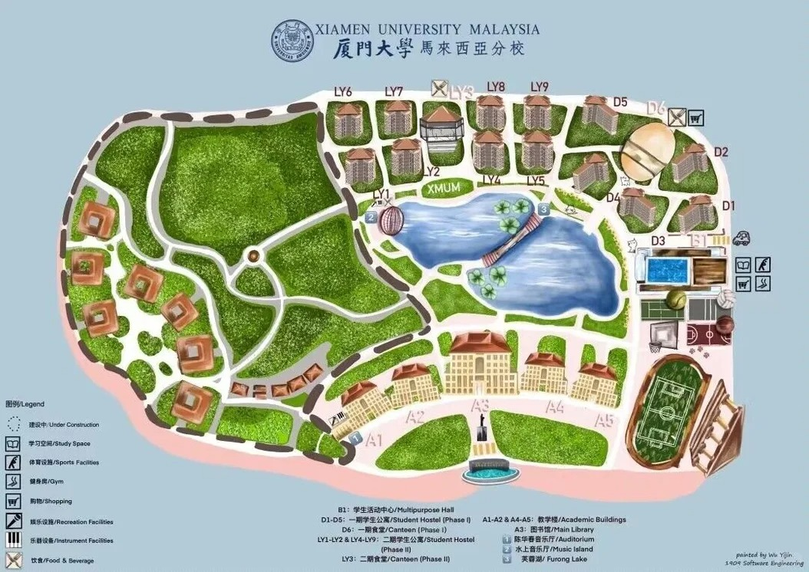
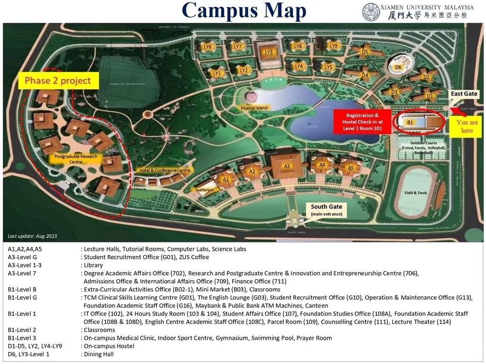

# 欢迎来到 XMUM Wiki

欢迎来到厦门大学马来西亚分校自救指南/XMUM Wiki！本项目旨在为厦大马校的同学们提供一个全面的信息共享平台，帮助大家更好地适应和享受在马校的学习与生活。

你可以通过点击侧边栏或链接，浏览完整的文档内容。

# 校园地图

# 科系简写
| 缩写 | 名称                     |
|--------------|----------------------------------|
| ACC          | 会计                            |
| ADT          | 广告                            |
| AIT          | 人工智能科技                      |
| CHS          | 中文系                          |
| CME          | 化学工程                         |
| CST          | 计算机科学                       |
| CYS          | 网络空间安全                      |
| DSC          | 数据科学                         |
| DMT          | 多媒体科技                       |
| ECM          | 电子商务                         |
| EEE          | 电子信息                         |
| EGE          | 新能源                          |
| ENG          | 英文                            |
| FIA          | 文科&社会科学预科班                |
| FIN          | 金融                            |
| FIS          | 理科预科班                       |
| IBU          | 国际商务                         |
| JRN          | 新闻                            |
| MAT          | 数学                            |
| MBA          | 工商管理硕士                      |
| MBT          | 海洋科技                         |
| MEC          | 海洋科学/海洋环境化学             |
| PHY          | 物理                            |
| SWE          | 软件工程                         |
| TCM          | 中医                            |

# 如何贡献
我们非常欢迎您为本指南贡献内容！您可以通过以下方式参与：

*注：开发组成员正在加急开发网站的在线编辑功能，在该功能发布之前，同学们可以采取下面的方式进行贡献*
1. **加入内容部微信群**：扫描下方二维码，加入内容部微信群，与其他同学交流和讨论。
   
2. **打开文档**:进入群公告内的腾讯共享文档链接
3. **编辑文档**：在共享文档中添加或修改内容，确保信息准确、客观、实用。
4. **保存更改**：完成编辑后，保存您的更改，并且根据您的个人意愿决定是否留名。
5. **通知开发组**：在微信群中通知开发组成员，告知他们您已完成编辑，以便他们将更改合并到项目中。
6. **等待审核**：开发组将审核您的更改，并在确认无误后将其合并到项目中。
7. **查看更新**：您可以在wiki中查看您的贡献是否已被合并。
请确保您的贡献内容准确、客观、实用。

# 许可证
本项目采用 [GNU GENERAL PUBLIC LICENSE Version 3](LICENSE) 许可证。